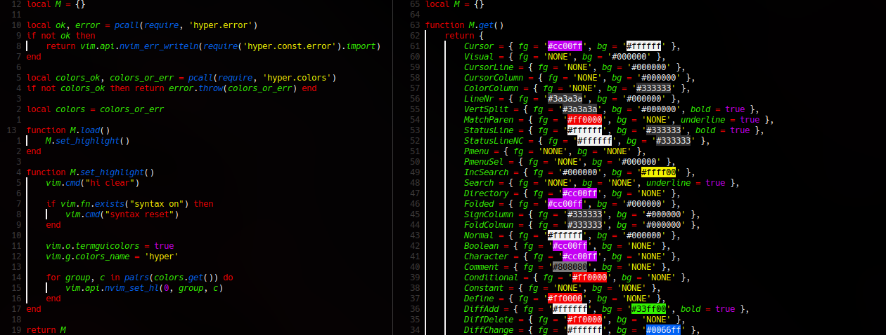
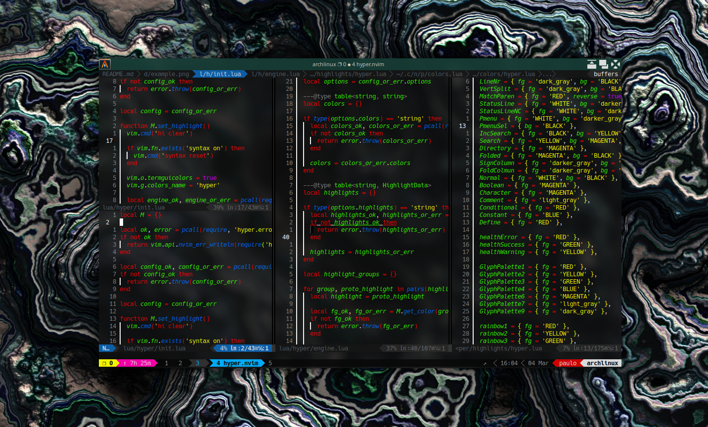

# hyper.nvim

A [Lua](https://www.lua.org/) port of the [Hyper.vim](https://github.com/jdsimcoe/hyper.vim)
theme for [Neovim](https://neovim.io/) with a few opinionated changes.



## Installation and usage

Install via your favorite plugin manager, for example [lazy](https://github.com/folke/lazy.nvim):

```lua
-- init.lua or plugins/hyper.lua
  'paulo-granthon/hyper.nvim',
```

Or [packer](https://github.com/wbthomason/packer.nvim):

```lua
-- init.lua
use('paulo-granthon/hyper.nvim')
```

## Enable hyper.nvim

Make sure to call `load` at some point.
If you use Lazy, you can do it by declaring the plugin dependency like this:

```lua
-- init.lua or plugins/hyper.lua
  {
    'paulo-granthon/hyper.nvim',
    config = function()
      require('hyper').load()
    end
  }
```

Or by including the following line in your `init.lua`:

```lua
-- init.lua
require('hyper').load()
```

## Customization

Currently, customization is still a work in progress.

`todo!()`

Personaly, I think the theme looks the best while having a transparent background,
so I use the following settings to achieve that:

```lua
vim.api.nvim_set_hl(0, 'Normal', no_bg)
vim.api.nvim_set_hl(0, 'NormalFloat', no_bg)
vim.api.nvim_set_hl(0, 'EndOfBuffer', no_bg)

vim.api.nvim_set_hl(0, 'TabLineFill', no_bg)
vim.api.nvim_set_hl(0, 'TabLine', no_bg)
vim.api.nvim_set_hl(0, 'TabLineSel', no_bg)

vim.api.nvim_set_hl(0, 'SpecialKey', no_bg)
vim.api.nvim_set_hl(0, 'NonText', no_bg)

vim.api.nvim_set_hl(0, 'LineNrAbove', line_nr_colors)
vim.api.nvim_set_hl(0, 'LineNr', { fg = 'white', bg = 'none' })
vim.api.nvim_set_hl(0, 'LineNrBelow', line_nr_colors)

vim.api.nvim_set_hl(0, 'SignColumn', no_bg)
```

Coupled with [Picom](https://github.com/yshui/picom)'s `blur-background` options, it looks like this:



## License

This project is licensed under the [MIT License](https://github.com/paulo-granthon/hyper.nvim/blob/main/LICENSE).
